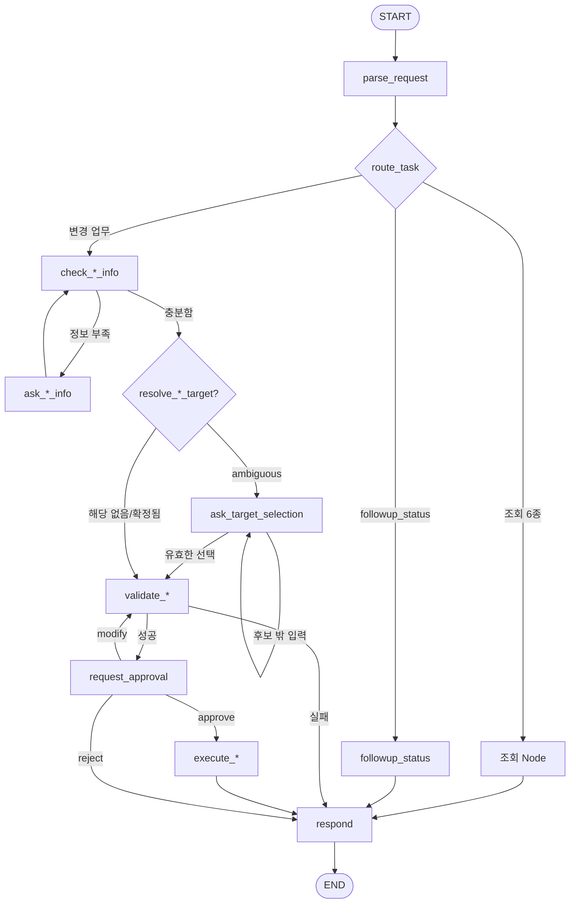
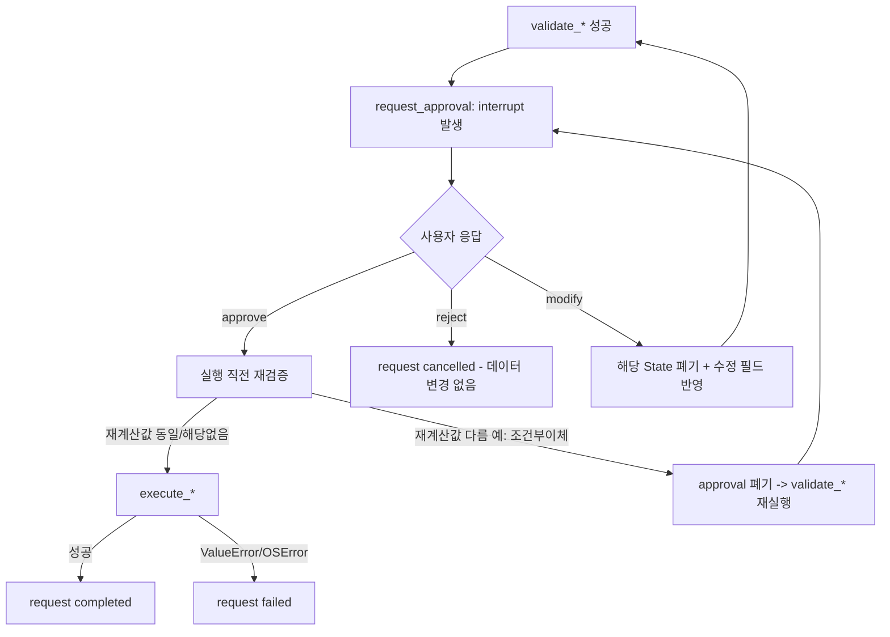

# 금융 업무 AI Agent 최종 설계

이 문서는 Phase 0~32에서 실제로 구현된 코드(`src/graph.py`, `src/functions.py`,
`src/data_store.py`, `src/main.py`, `app.py`)를 기준으로 작성한다. 처음 계획했던
구조가 아니라 **현재 실제 동작하는 구조**를 설명하는 것이 목적이며, 설계 초안
(`design-draft.md`)과 다른 부분은 22장에서 별도로 정리한다.


위 그림은 전체 흐름을 한 장으로 정리한 것이다. Mermaid 원본은
`images/design-final.mmd`에 함께 보관한다. 업무별 세부 흐름과 각 분기의
조건은 아래 본문과 "Mermaid 흐름도" 절에서 이어서 설명한다.

## 1. 프로젝트 설계 목표

사용자의 자연어 금융 요청을 해석해 계좌·이체·카드·재발급·청구서 업무를
처리하는 LangGraph 기반 Agent를 만든다. 조회 업무는 즉시 실행하고, 실제
금융 데이터를 변경하는 업무는 반드시 사용자 승인을 거친 뒤에만 실행한다.
금융 규칙 판단(잔액 계산, 상태 전이 허용 여부, 대상 존재/소유권 확인)은
LLM에 맡기지 않고 Python 함수가 담당하며, LLM은 자연어 해석만 담당한다.

## 2. 최종 시스템 구조

```text
사용자
  ↓
src/main.py
  - CLI 입력 루프, 종료 명령("종료"/"exit"/"quit")
  - thread_id = f"financial-agent:{OWNER_ID}" (owner 기준 고정)
  - interrupt resume(clarification/target_selection/approval)
  - 재시작 시 중단된 interrupt 복구(_recover_interrupted_session)
  ↓
src/graph.py
  - AgentState (TypedDict)
  - parse_request(): LLM으로 자연어 요청 해석
  - Node/Edge/Router(StateGraph)
  - clarification / target_selection / approval(HITL)
  ↓
src/functions.py
  - owner_id 검증, 잔액 계산, 상태 전이 규칙
  - 계좌/카드/청구서/재발급 조회
  - 실제 데이터 변경(execute_*), requests 기록(create_request/update_request_status)
  ↓
src/data_store.py
  - load_bank_data / save_bank_data(임시파일 교체 방식) / reset_bank_data
  ↓
data/bank_data.json  (실행 중 조회·변경되는 작업 데이터)

──────────────────────────────

LangGraph 실행 상태(State, interrupt 위치)
  ↓
runtime/checkpoints.sqlite  (SqliteSaver, Git 미추적)
```

`data/bank_data.json`과 `runtime/checkpoints.sqlite`는 역할이 다르다.
`bank_data.json`은 계좌/카드/청구서/거래/재발급 신청과 `requests`(업무 처리
이력)를 담는 **금융 업무 데이터**이고, `checkpoints.sqlite`는 LangGraph가
"지금 어느 Node에서 멈춰 있고 State가 무엇인지"를 담는 **실행 상태**다.
승인 전에는 `bank_data.json`의 accounts/cards/bills/transactions/reissue 같은
실제 업무 대상 데이터가 절대 바뀌지 않지만, `requests` 배열은 `create_request`가
pending 기록을 남기는 시점(승인 화면을 보여주기 전)부터 이미 변경될 수 있다.

`app.py`(Streamlit 데모)는 `src/main.py`와 나란한 또 하나의 진입점이다.
같은 `src/graph.py` Agent를 그대로 호출하고 분기·검증 로직을 새로 만들지
않는다. CLI 세션과 겹치지 않도록 checkpoint는 `runtime/demo_checkpoints.sqlite`를
따로 쓰고, `runtime/demo_session_id.txt`에 저장된 session_id로 thread_id를
고정해 Streamlit 서버가 재시작돼도 중단된 interrupt를 복구한다. 사이드바의
"새 대화 시작"(대화 스레드만 새로 발급)과 "테스트 금융 데이터 원상복구"
(`bank_data.json`을 `initial_data.json` 기준으로 되돌림)는 서로 다른 버튼으로
분리돼 있어, 대화만 정리하고 싶을 때 금융 데이터가 함께 초기화되지 않는다.

## 3. LLM과 Python의 역할 분리

### LLM이 담당하는 것
- 자연어 요청을 20개 `task_type` 중 하나로 분류 (`TaskClassification`)
- 업무별 세부 정보 추출(계좌 별명, 금액, 카드 이름, 배송지 등)
- clarification 답변에서 부족했던 필드만 추출
- 승인 대기 중 사용자 응답을 approve/reject/modify로 해석(`ApprovalDecision`)
- followup_status 요청이 어떤 종류의 이전 업무를 가리키는지(`followup_category`)만 판단

### Python이 담당하는 것
- owner_id 소유권 검증 (계좌/카드/청구서/재발급 신청 모두)
- 잔액 계산, 이체 금액/조건 검증
- 카드 상태 전이 허용 여부(`_ALLOWED_CARD_TRANSITIONS`), 재발급 신청 상태 규칙
- 대상 후보 검증(found/not_found/ambiguous)과 후보 번호 유효성(`_match_index`)
- 실제 데이터 변경(계좌 잔액, 카드 상태, 청구서 상태, 거래 내역, 재발급 신청)
- JSON 저장, requests 기록/상태 갱신

LLM이 "이체 가능 여부"나 "카드 상태 전이 허용 여부"를 판단하는 곳은 코드
어디에도 없다. 그 판단은 전부 `find_transfer_accounts`/`validate_transfer_amount`/
`validate_card_status_change`류의 Python 함수가 한다.

## 4. 전체 Agent 처리 흐름

```text
START
  → parse_request (LLM 분류 + transient State 초기화 + context 보완)
  → route_task(task_type)
      ├─ 조회 업무 → 해당 조회 Node → respond → END
      │   (단, reissue_lookup은 재발급 신청이 여럿이면 ask_reissue_selection에서
      │    번호 선택을 받은 뒤 respond → END - followup_status와 동일 패턴)
      ├─ 변경 업무 → check_*_info → (부족하면 ask_*_info 루프) → validate_*(/resolve_*_target)
      │                → 실패: respond → END
      │                → 성공: request_approval(interrupt)
      │                    → approve: execute_* → respond → END
      │                    → reject:  respond → END
      │                    → modify:  재검증 Node로 되돌아가 새 approval
      ├─ lost_then_reissue → check_ltr_start → (승인1: 정지) → (승인2: 재발급) → respond → END
      └─ followup_status → requests 조회 → (후보 여럿이면 ask_followup_selection) → respond → END
```

## 5. Agent State

`src/graph.py`의 `AgentState`(TypedDict) 실제 필드를 의미별로 묶으면 다음과 같다.

**공통**: `request`, `owner_id`, `task_type`, `request_id`, `approval`, `result`, `error`

**즉시/조건부/다계좌 이체**: `source_nickname`, `destination_nickname`, `amount`,
`transfer`, `remaining_amount`, `conditional`, `multi_destinations`, `multi_transfer`

**계좌 별명 변경**: `target_nickname`, `new_nickname_input`, `rename`

**카드 상태 변경**: `card_name`, `card_change`

**카드 재발급**: `address_label`, `reissue`, `reissue_update`, `reissue_cancel`

**분실 정지 후 재발급 복합 흐름**: `composite_next`, `ltr_lock_result`

**청구서**: `bill_name`, `pay_bill`, `pay_all_bills`

**거래내역 조회**: `account_nickname`, `period`, `start_date`, `end_date`,
`min_amount`, `transaction_type`

**후속 결과 조회(Phase 22)**: `followup_category`, `recency_hint`, `followup_candidates`

**재발급 신청 조회 후보 선택**: `reissue_candidates` (신청이 여럿일 때만 채워지고,
`followup_candidates`와 동일한 패턴으로 `ask_reissue_selection`이 소비한다)

**ambiguous 후보 선택(Phase 23)**: `resolved_account_id`, `resolved_card_id`,
`resolved_address_id`, `target_candidates`, `target_candidate_kind`

**대화 맥락(Phase 23)**: `context`

## 6. State의 transient / persistent 성격

State에는 성격이 다른 두 그룹이 있다.

**매 top-level 요청마다 초기화되는 transient State**: `parse_request()`가 매번
`request_id`, `transfer`, `conditional`, `multi_transfer`, `rename`,
`card_change`, `reissue`, `reissue_update`, `reissue_cancel`, `pay_bill`,
`pay_all_bills`, `approval`, `result`, `error`, `composite_next`,
`ltr_lock_result`, `followup_candidates`, `reissue_candidates`, `resolved_account_id`,
`resolved_card_id`, `resolved_address_id`, `target_candidates`,
`target_candidate_kind`를 `None`으로 되돌린다. 이전 업무의 실행/검증/승인
상태가 새 요청에 섞여 들어가지 않도록 하기 위함이다. `parse_request`는
START에서만 실행되고 interrupt resume(`Command(resume=...)`)은 이 Node를
다시 거치지 않으므로, resume 도중 State는 이 초기화의 영향을 받지 않는다.

**다음 요청까지 유지되는 대화 context**: `context`는 `parse_request()`가
초기화하지 않는 유일한 State다. `account_lookup`/`card_lookup`/
`reissue_lookup`이 결과를 1건으로 좁혔을 때만 `context["account_nickname"]`
또는 `context["card_name"]`을 채우고, 2건 이상이면 즉시 지운다(오래된 값이
새어나가지 않게). `respond()`는 이번 turn에 `request_id`가 생겼다면
`context["last_request_id"]`도 남긴다.

context는 오직 **대상 이름 보완**에만 쓰인다. 이전 금액, 이전 이체 목적지,
이전 승인 의사는 절대 context로 자동 재사용하지 않는다 — `parse_request()`가
`source_nickname`/`target_nickname`/`card_name`이 비어 있을 때만 context를
참조하는 코드 구조 자체가 그 이상을 재사용할 수 없게 만든다.

## 7. 주요 Node

실제 `graph_builder.add_node()` 52개(+ 내부 `__start__`/`__end__` 2개 = 컴파일
결과 54개 Node, 코드로 직접 확인)를 기능별로 묶으면 다음과 같다.

| 그룹 | Node |
|---|---|
| 공통 | `parse_request`, `respond` |
| 조회 | `account_lookup`, `total_balance`, `transaction_lookup`, `card_lookup`, `reissue_lookup`, `unpaid_bills` |
| 후속 조회 | `followup_status`, `ask_followup_selection` |
| 재발급 신청 조회 후보 선택 | `ask_reissue_selection` (신청 여럿일 때만 거침, followup과 동일 패턴) |
| clarification | `check_transfer_info`/`ask_transfer_info`, `check_rename_info`/`ask_rename_info`, `check_conditional_info`/`ask_conditional_info`, `check_multi_info`/`ask_multi_info`, `check_card_info`/`ask_card_info`, `check_reissue_info`/`ask_reissue_info`, `check_reissue_update_info`/`ask_reissue_update_info`, `check_reissue_cancel_info`/`ask_reissue_cancel_info`, `check_pay_bill_info`/`ask_pay_bill_info`, `check_pay_all_info`/`ask_pay_all_info` |
| target selection | `resolve_rename_target`, `resolve_card_target`, `resolve_reissue_target`, `resolve_reissue_cancel_target`, `ask_target_selection` |
| validation | `validate_transfer`, `validate_rename`, `validate_conditional`, `validate_multi`, `validate_card_change`, `validate_reissue`, `validate_reissue_update`, `validate_reissue_cancel`, `validate_pay_bill`, `validate_pay_all` |
| approval | `request_approval` |
| 복합 업무(lost_then_reissue) | `check_ltr_start`, `start_ltr_lock`, `start_ltr_reissue_skip_lock`, `start_ltr_fail`, `ltr_continue_to_reissue` |

## 8. Router / Edge 구조

최상위 흐름은 `START → parse_request → route_task(task_type) → 업무별 진입 Node`다.
`route_task`는 `TaskClassification.task_type` 20개 값을 그대로 딕셔너리
키로 받아 대응하는 Node로 보낸다(코드로 1:1 대조 완료, 누락 없음).

세부 흐름은 반복되는 패턴이다.

```text
check_*_info
  → (부족한 필드 있음) ask_*_info → check_*_info (루프)
  → (충분함) resolve_*_target 또는 validate_*
      → ambiguous 후보 있음 → ask_target_selection
          → 후보 밖 입력 → ask_target_selection (재질문)
          → 유효한 선택 → 원래 업무의 validate_* 로 복귀
      → validate_*
          → 실패 → respond → END
          → 성공 → request_approval
              → approve → execute_* → respond → END
              → reject  → respond → END
              → modify  → 해당 업무의 재검증 Node로 복귀(새 approval)
```

`lost_then_reissue`는 `check_ltr_start`에서 카드가 이미 `lost`인지에 따라
`start_ltr_lock`(정지 단계 진입) 또는 `start_ltr_reissue_skip_lock`(정지
단계 생략)으로 갈라진다. 정지 단계가 approve로 완료되면 `route_approval`이
`composite_next == "reissue"`를 보고 `continue_composite`로 분기해
`ltr_continue_to_reissue`를 거쳐 재발급 단계(`check_reissue_info`)로 이어간다.

## Mermaid 흐름도

### 전체 흐름



### Human-in-the-Loop 세부 흐름



## 9. 업무별 흐름

### 9-1. 조회 업무

`account_lookup`/`total_balance`/`transaction_lookup`/`card_lookup`/
`reissue_lookup`/`unpaid_bills` 6개는 공통적으로 interrupt/approval이 없고
`bank_data.json`을 변경하지 않으며 곧바로 `respond → END`로 끝난다.
`followup_status`도 approval/interrupt 없이 조회로 끝나지만, 다른 조회
업무와 달리 **현재 금융 데이터가 아니라 과거 `requests` 기록**을 읽는다는
점이 다르다(9-10 참고).

예외로 `reissue_lookup`은 재발급 신청이 2건 이상이면 `ask_reissue_selection`이
clarification 성격의 interrupt로 번호를 받는다(승인이 아니라 "어떤 걸
말하는지" 확인이라 approval과는 다르다 - `followup_status`가 후보 여럿일 때
`ask_followup_selection`을 거치는 것과 동일한 패턴). 0건이면 안내 문구,
1건이면 interrupt 없이 바로 반환한다.

### 9-2. 즉시이체 (`instant_transfer`)

`check_transfer_info`(source/destination/amount)→`validate_transfer`
(`find_transfer_accounts` + `validate_transfer_amount`)→승인→
`execute_instant_transfer`. 대상 계좌는 `find_transfer_accounts`가
`resolve_account_candidates()`로 찾으므로 현재 사용자 안에서 같은 별명이 2개
이상이면 임의로 하나를 고르지 않고 `"계좌 별명이 여러 개와 일치합니다"`로
실패한다. target_selection(번호 선택)까지는 연결돼 있지 않다 — 14장 표 참고.
`resolve_account_candidates()`는 정확히 일치하는 별명을 우선 찾고, 없을
때만 공백 차이(`"여행 자금"` ↔ `"여행자금"`)를 무시하고 다시 찾는다 —
저장된 nickname 값 자체는 바꾸지 않는다. 이 정책은 즉시/조건부/다계좌
이체, 청구서 납부, 거래내역 조회, 별명 변경 대상 탐색에 공통 적용된다.

### 9-3. 조건부 이체 (`conditional_transfer`)

`remaining_amount`(출금 계좌에 남길 금액)를 받아 `validate_conditional_transfer`가
`transfer_amount = 현재 잔액 - remaining_amount`를 계산한다. 승인 대기 중
잔액이 바뀌는 경우의 특수 처리는 10장에서 따로 설명한다.

### 9-4. 다계좌 이체 (`multi_transfer`)

`validate_multi_transfer`가 동일 목적지를 합산하고, 총액이 잔액을 넘으면
전체를 실패시킨다(부분 성공 없음). `execute_multi_transfer`는 모든 변경을
메모리에서 준비한 뒤 `save_bank_data()`를 한 번만 호출한다. 저장 정책은
11장에서 pay_all_bills와 대조해 설명한다.

### 9-5. 계좌 별명 변경 (`rename_account`)

`resolve_rename_target`이 `target_nickname`으로 ambiguous 여부를 먼저 확인한다.
ambiguous면 `ask_target_selection`으로, 아니면 `validate_rename`으로 간다.
`resolved_account_id`가 있으면 `validate_account_nickname_by_id`로, 없으면
이름 기반 `validate_account_nickname`으로 검증한다.

### 9-6. 카드 상태 변경 (`card_lock`/`card_unlock`/`card_lost`)

목표 상태는 `_CARD_TARGET_STATUS` 매핑(`card_lock→temporarily_locked`,
`card_unlock→active`, `card_lost→lost`)으로 task_type에서 그대로 결정한다.
허용되는 전이는 `_ALLOWED_CARD_TRANSITIONS`: `active↔temporarily_locked`,
`active/temporarily_locked → lost`. `lost`에서 다른 상태로의 전이, 자기
자신으로의 전이는 모두 금지된다. 카드 이름이 ambiguous면 `resolve_card_target`
→ `ask_target_selection`을 거친다.

### 9-7. 카드 재발급 신청 (`card_reissue`)

`validate_reissue_request`가 카드 상태가 `lost`인지, 배송지가 존재하는지,
같은 카드에 취소되지 않은(`requested`/`in_production`/`shipping`) 기존
신청이 없는지 확인한다. `resolve_reissue_target`이 카드 이름과 배송지
label을 순서대로 확인해 ambiguous면 각각 `ask_target_selection`으로 보낸다
(18장 참고). 승인 전까지 `reissue_applications`는 변경되지 않고, 승인
후에도 카드 `status`는 바뀌지 않는다(신청만으로 lost→active가 되지 않음).

### 9-8. 재발급 배송지 변경 (`reissue_update`) / 취소 (`reissue_cancel`)

`resolve_active_reissue_application`이 대상 카드의 진행 중 신청 1건을 찾는다.
배송지 변경/취소 모두 신청 상태가 `requested`일 때만 허용된다(`in_production`/
`shipping`/`cancelled`는 금지). `reissue_cancel`은 카드만 대상이므로
`resolve_reissue_cancel_target`이라는 더 단순한 별도 Node를 쓴다.

### 9-9. 분실 정지 후 재발급 복합 흐름 (`lost_then_reissue`)

10장에서 상세히 설명한다.

### 9-10. 청구서 납부 (`pay_bill`/`pay_all_bills`)

11장에서 `multi_transfer`와 대조해 상세히 설명한다.

### 9-11. 후속 결과 조회 (`followup_status`)

`followup_status`는 `bank_data.json["requests"]`를 읽는 조회이며 새
`requests` 기록을 만들지 않는다. 선택 정책은 (1) 이번 대화의
`context["last_request_id"]`가 있고 업무 종류가 맞으면 우선 사용
(2) 아니면 관련 task_type의 최근 기록을 조회 (3) 후보 1개면 바로 안내
(4) 여러 개인데 `recency_hint`(아까/방금/최근)가 있으면 최신 1건
(5) 그래도 불확실하면 `ask_followup_selection`으로 번호 선택을 요구한다.
`pay_all_bills`처럼 batch 자체 status(completed)와 bill별 결과
(completed/failed 혼재)가 다를 수 있는 경우는 `_format_followup_result`가
이를 분리해서 보여준다.

## 10. 승인 대기 중 잔액이 바뀌는 조건부 이체 (Phase 13/26/27 검증)

`_request_conditional_approval`은 approve 응답을 받으면 **실행하기 직전에
`validate_conditional_transfer`를 다시 호출**해 최신 잔액 기준으로
`transfer_amount`를 재계산한다. 승인 화면에 표시했던 스냅샷의 금액과 재계산
결과가 다르면, 과거 승인을 그대로 실행하지 않고 `{"approval": "modifying",
"conditional": None}`을 반환해 `validate_conditional`로 되돌아가 최신 값
기준의 새 승인 화면을 다시 보여준다. 같으면 그 값으로 `execute_conditional_transfer`를
실행한다.

## 11. 다계좌 이체 vs 일괄 청구서 납부 저장 정책

둘 다 "여러 건을 한 번에 처리"하는 업무이지만 저장 정책이 다르다.

**다계좌 이체(`execute_multi_transfer`)**: 모든 목적지의 잔액 변경/거래
생성을 메모리에서 준비한 뒤 `save_bank_data()`를 **한 번만** 호출한다.
목적지 A는 성공하고 B는 실패하는 부분 반영 상태가 파일에 남을 수 없다
(저장 자체가 원자적 1회이므로). 총액이 잔액을 초과하면 실행 전에 전체를
실패시킨다.

**일괄 청구서 납부(`execute_batch_bill_payment`)**: 승인된 bill_id를
납기일 빠른 순으로 순회하며 **bill 하나마다 `save_bank_data()`를 호출**한다.
- 잔액 부족: 해당 bill만 `failed`(`reason: insufficient_balance`)로 남기고
  `unpaid` 유지, 다음 bill을 계속 처리한다(전체 중단 없음).
- 저장 실패(`OSError`): 해당 bill을 `failed`(`reason: save_error`)로 남기고
  그 즉시 반복을 중단한다. 이미 저장에 성공한 이전 bill들은 rollback하지
  않고 그대로 두며, 아직 시도하지 않은 이후 bill들은 `unprocessed`로 표시한다.

이 차이는 요구사항 자체가 다르기 때문이다. 다계좌 이체는 "한 번의 의사결정
= 한 번의 원자적 결과"가 맞지만, 일괄 납부는 "각 청구서를 개별적으로
처리하되 하나의 실패가 나머지를 막지 않아야" 하므로 건별 저장이 필요하다.

## 12. 분실 정지 후 재발급 복합 흐름 (`lost_then_reissue`)

한 Node 안에서 interrupt를 두 번 연달아 처리하지 않는다. 대신 독립된
두 단계로 이어진다.

```text
check_ltr_start (카드가 이미 lost인지 확인)
  ├─ lost 아님 → start_ltr_lock (task_type=card_lost, composite_next="reissue")
  │                 → validate_card_change → request_approval(승인 1)
  │                     → approve → 카드 lost로 실제 반영(completed)
  │                     → route_approval이 composite_next=="reissue"를 보고
  │                       continue_composite → ltr_continue_to_reissue
  │                         (request_id/card_change/approval/result 초기화,
  │                          이전 결과는 ltr_lock_result에 보존)
  │                         → check_reissue_info → ... → request_approval(승인 2)
  └─ 이미 lost → start_ltr_reissue_skip_lock (정지 단계 생략, ltr_lock_result에 스킵 사유 기록)
                    → check_reissue_info → ... → request_approval(승인 2)
```

승인 1(정지)이 완료돼 카드가 실제로 `lost`로 저장된 뒤에는, 승인 2(재발급)가
실패하거나 거절되더라도 이미 적용된 `lost` 상태를 되돌리지 않는다. 두 단계는
`create_request`가 독립적으로 두 번 호출되어 서로 다른 `request_id`(child
request 2개)로 기록된다.

**두 단계 결과 합치기**: `respond()`는 `ltr_lock_result`(정지 단계 결과)와
재발급 단계 결과를 `{"lock": ..., "reissue": ...}` 한 덩어리로 묶어 안내한다.
재발급 단계가 **검증 실패**로 끝나면 State에는 `result=None`, `error="..."`만
남으므로, `respond()`가 `result`가 비어 있을 때 `error`를 재발급 결과 자리로
올린다. 그래서 `"이미 진행 중인 재발급 신청이 있습니다"`,
`"배송지를 찾을 수 없습니다"` 같은 실패 사유가 정지 결과와 함께 그대로
사용자에게 전달된다(단일 `card_reissue` 경로의 문자열 결과 형태는 그대로 유지).

## 13. clarification

정보가 부족하면 LLM이 임의로 채우지 않는다. 예: `"저축으로 10만원 보내줘"`
→ `source_nickname`이 비어 있음 → clarification.

```text
check_*_info (missing field 확인만, State 변경 없음)
  → route_*_info: 부족한 필드 있음 → ask_*_info
      → interrupt({"type": "clarification", "missing_fields": [...], "question": ...})
      → 사용자 답변
      → 전용 clarifier(LLM)가 답변에서 그 필드만 추출해 보완
      → check_*_info로 복귀(루프)
  → 충분함 → validate_* 로 진행
```

## 14. target_selection

동일 이름 후보가 여러 개인 경우 임의로 하나를 선택하지 않는다. 다만 **모든
업무가 번호 선택(target_selection)까지 연결돼 있지는 않다.** 처리는 두 갈래다.

| 처리 | 업무 |
|---|---|
| (1) target_selection으로 사용자에게 번호 선택을 받음 | `rename_account`(계좌), `card_lock`/`card_unlock`/`card_lost`(카드), `card_reissue`/`reissue_update`(카드·배송지), `reissue_cancel`(카드) |
| (2) ambiguity를 감지하고 안전하게 실패 | `instant_transfer`/`conditional_transfer`/`multi_transfer`의 출금·입금 계좌, `pay_bill`/`pay_all_bills`의 대상, `lost_then_reissue`의 대상 카드 |

(2)도 후보 하나를 임의로 고르지 않는다는 원칙은 동일하며, `"계좌 별명이 여러
개와 일치합니다: ..."` / `"카드 이름이 여러 개와 일치합니다: ..."`로 이유를
안내하고 승인 단계에 진입하지 않는다. 아래 설명은 (1)에 해당하는 흐름이다.

```text
resolve_*_candidates(owner_id, name)
  → status == "ambiguous"
      → target_candidates/target_candidate_kind를 State에 남김
      → ask_target_selection: 후보 번호+ID+상태(또는 잔액)를 보여주고
        interrupt({"type": "target_selection", ...})
      → 사용자 응답을 _match_index()로 검증
          - _match_index는 순수 Python 함수다. 번호(1-based)만 유효한
            선택으로 받아들이고, 범위 밖이거나 숫자가 아니면 None을 반환해
            같은 후보 목록으로 재질문한다(ask_target_selection 재진입).
      → 유효하면 resolved_account_id/resolved_card_id/resolved_address_id에
        정확한 ID를 저장하고 route_target_selection이 원래 업무의
        validate_*(또는 resolve_reissue_target/resolve_reissue_cancel_target,
        남은 ambiguity가 있을 수 있으므로)로 되돌린다.
```

후보 선택 유효성 검증을 LLM에 맡기지 않는 이유는, LLM이 후보 목록 밖의
이름이나 ID를 "그럴듯하게" 만들어낼 위험을 원천 차단하기 위해서다. 선택은
번호 매칭이라는 결정적(deterministic) 연산이므로 Python이 담당하는 것이
더 단순하고 더 안전하다.

`resolve_reissue_target`은 카드→배송지 순서로 확인하고, 선택 후 같은 Node로
되돌아와(`route_target_selection`의 `"reissue"` 분기) 남은 ambiguity만
마저 확인한다. `reissue_cancel`은 카드만 대상이라 `resolve_reissue_cancel_target`
이라는 더 단순한 전용 Node를 쓴다.

## 15. 승인 / 거절 / 수정

세 경로는 `request_approval`(및 업무별 `_request_*_approval`) 안에서
명확히 갈라진다.

**승인(approve)**: 실행 직전 재검증(조건부 이체/다계좌 이체는 명시적으로
`validate_*`를 다시 호출, 나머지는 `execute_*` 내부에서 owner/상태를
재확인) → `execute_*` → 성공 시 `request.status = completed`, 실패
(`ValueError`/`OSError`) 시 `request.status = failed`.

`execute_*`의 재검증은 호출자가 넘긴 값을 믿지 않는 최종 방어선이다.
`execute_bill_payment()`는 넘겨받은 `amount`가 현재 `bill["amount"]`와 같은지도
확인하고, 다르면 bill 금액으로 조용히 덮어쓰지 않고 실행 자체를 막는다 —
사용자가 승인한 금액과 다른 금액을 집행하지 않기 위해서다(청구서는 전액 납부).

**거절(reject)**: `execute_*`를 호출하지 않고 `request.status = cancelled`.
`bank_data.json`의 accounts/cards/bills/transactions/reissue는 전혀
바뀌지 않는다.

**수정(modify)**: 해당 업무의 State(예: `transfer`, `rename`, `card_change`)를
`None`으로 폐기하고, `ApprovalDecision`이 추출한 새 필드만 반영한 뒤
재검증 Node로 되돌아가 **새로운** `interrupt`를 발생시킨다. 이전 승인
스냅샷은 재사용되지 않는다 — modify 경로는 항상 validate_* 전체를 다시
거친다.

## 16. requests 처리 기록

`bank_data.json["requests"]`는 업무 하나의 생애주기를 추적하는 기록이다.

```text
pending (create_request 직후)
  → awaiting_approval (validate_* 성공)
  → completed / cancelled / failed
```

`requests`(업무 이력 + status + result)와 SQLite `checkpoint`(Graph가
지금 어느 Node에서 멈춰 있고 State가 무엇인지)는 서로 다른 것이다.
`requests`는 "무슨 일이 있었는지"의 기록이고, checkpoint는 "지금 실행이
어디서 멈춰 있는지"의 스냅샷이다. 이 둘의 불일치를 안전하게 처리하는
방법은 17장에서 설명한다.

## 17. SQLite Checkpointer / 재시작 복구

Phase 24에서 `InMemorySaver`를 `langgraph.checkpoint.sqlite.SqliteSaver`로
교체했다(`src/graph.py`). 이유: 이 프로젝트는 단일 사용자·로컬·동기 CLI
데모라 별도 서버가 필요한 Postgres 등은 과하고, SQLite 파일 하나로 충분하다.

- checkpoint 경로: `runtime/checkpoints.sqlite`(`DEFAULT_CHECKPOINT_PATH`).
  `.gitignore`에 등록돼 있고 Git에 커밋되지 않는다.
- `thread_id = f"financial-agent:{OWNER_ID}"` 고정값. 이 프로젝트는
  `owner_id="user-001"` 단일 사용자 데모이므로 재시작 후에도 같은
  checkpoint를 다시 찾을 수 있다.
- `open_graph(checkpoint_path=None)`이 `SqliteSaver.from_conn_string(path)`를
  context manager로 감싸 `main.py`의 `with` 블록(= CLI 프로세스 생명주기)
  동안 connection을 유지하고, 블록을 벗어나면 정리한다. 테스트는
  `CHECKPOINT_PATH` 인자/환경변수로 임시 DB를 주입해 실제 runtime DB를
  건드리지 않을 수 있다.
- 프로그램 시작 시 `graph.get_state(config)`로 중단된 실행이 있는지 확인한다
  (`snapshot.next`가 비어 있지 않으면 중단 상태). 중단된 interrupt의
  `type`(approval/clarification/target_selection)에 맞춰 내용을 다시
  보여주고 새 입력을 받는다.

**핵심 안전 원칙: 재시작 전 사용자의 과거 승인 의사를 자동으로 replay하지
않는다.** 승인 대기 상태였다면 반드시 승인 내용을 다시 보여주고, 사용자가
새로 입력한 응답으로만 `Command(resume=...)`를 호출한다.

## 18. Phase 26 안전 버그가 최종 재시작 설계에 반영된 내용

재시작 시 approval interrupt를 복구할 때, checkpoint의 `request_id`가
가리키는 `requests` 기록의 상태를 확인한다.

- `requests`에 그 `request_id` 기록이 **아예 없음** → 상태 불일치로
  간주해 `resume`을 호출하지 않고 승인 입력도 요구하지 않은 채 안내만
  하고 새 요청 입력 루프로 넘어간다(금융 실행 완전 차단).
- `requests` 기록은 있지만 이미 `completed`/`cancelled`/`failed`로
  종료돼 있음 → 마찬가지로 `resume`하지 않고 안내만 한다.
- `requests` 기록이 있고 `awaiting_approval` → 정상 상황이므로 승인
  내용을 다시 보여주고 새 입력을 받아 resume한다.

`request_id`가 아예 없는 clarification interrupt는 정상적인 상황일 수
있다(일부 업무는 필요한 정보가 다 채워진 뒤에야 `create_request`를 호출
하므로). "request_id 없음 = 오류"로 단정하지 않는다.

## 19. 대화 Context

특정 카드 조회로 대상이 하나로 확정된 뒤 `"그 카드 잠가줘"`는
`context["card_name"]`을 통해 안전하게 재사용할 수 있다(card_lock/unlock/
lost/card_reissue/reissue_update/reissue_cancel에 한함). 마찬가지로 계좌
조회 결과가 1건일 때 `context["account_nickname"]`을 이체 계열(source)과
`rename_account`(target)의 대상 보완에 쓸 수 있다.

다만 `"그 계좌에서 저축으로 10만원 보내줘"`처럼 **계좌가 여러 개인 상황**은
과장해서 지원된다고 설명하지 않는다. 현재 `account_lookup()`은 특정 별명
하나만 걸러내는 조회가 아니라 owner의 전체 계좌 목록을 반환하는 구조라서,
계좌가 여러 개 있으면 애초에 context가 "하나로 명확한 대상"으로 좁혀지지
않는다(`account_lookup`이 결과 1건일 때만 `context["account_nickname"]`을
채우고 그 외에는 지우기 때문). 이 경우 `source_nickname`은 비어 있는
그대로 남고 정상적인 clarification("어느 계좌에서 출금할까요?")으로 이어진다.

또한 Phase 27에서, LLM이 `"그 계좌"` 같은 지시어 표현 자체를
`source_nickname`/`destination_nickname` 문자열로 그대로 채워 넣어버려
context 보완 로직이 무력화되는 버그를 발견해 수정했다(`TaskClassification`의
필드 설명에 "지시어 표현은 비워둔다" 규칙 추가, commit `713e495`).

최종 정책: **현재 요청에 대상이 명시되면 그것을 우선 사용 → 명시가 없고
context에 정확히 하나의 안전한 대상이 있으면 제한적으로 재사용 → 그렇지
않으면 추가 질문 → 절대 임의로 추측하지 않음.** 금액, 이체 목적지, 승인
의사는 어떤 경우에도 context로 자동 재사용하지 않는다.

## 20. 실패 및 안전 처리

| 상황 | 처리 |
|---|---|
| 존재하지 않는 계좌/카드/청구서 | 실패, 데이터 변경 없음 |
| 잔액 부족 | 실패 |
| 모호한 대상(동일 이름 2개 이상) — 계좌 별명 변경/카드 상태 변경/재발급 3종 | 임의 선택 없이 target_selection으로 사용자 선택 요청 |
| 모호한 대상(동일 이름 2개 이상) — 이체 3종/청구서 납부/`lost_then_reissue` | 임의 선택 없이 "여러 개와 일치합니다" 실패(14장 참고) |
| 정보 부족 | clarification으로 추가 질문 |
| `lost` 카드 unlock, `lost`에서 재전이 | 상태 전이 규칙 위반으로 실패 |
| 이미 `paid`인 청구서 재납부 | 실패, 재납부 없음 |
| `in_production`/`shipping` 상태 재발급 배송지 수정·취소 | 실패(`requested`만 허용) |
| 승인 거절 | `cancelled`, 실제 금융 데이터 변경 없음 |
| 승인 대기 중 잔액 변경(조건부 이체) | 실행 직전 재검증, 값이 다르면 기존 승인 폐기 후 재승인 |
| checkpoint/requests 상태 불일치 | `resume` 금지, 승인 입력 요구 금지, 금융 실행 금지 |

## 21. 데이터 저장 구조

`data/initial_data.json`은 원본이며 프로그램이 직접 수정하지 않는다.
`data/bank_data.json`이 실행 중 조회·변경되는 작업 데이터다. `save_bank_data()`는
같은 디렉터리에 임시 파일을 완전히 쓴 뒤 `os.replace()`로 교체하므로,
저장 도중 오류(`OSError`)가 나도 기존 `bank_data.json`은 그대로 남는다
(부분 반영 방지의 근본 메커니즘). `reset_bank_data()`는 `initial_data.json`을
읽어 같은 안전 저장 방식으로 `bank_data.json`에 다시 쓴다.

`bank_data.json`은 CLI(`src/main.py`)와 Streamlit 데모(`app.py`)가 함께
읽고 쓰는 금융 데이터의 유일한 source of truth다. 두 진입점 모두
`src/functions.py`의 같은 `load_bank_data()`/`save_bank_data()`를 거치므로
어느 쪽에서 승인한 변경이든 즉시 반영되고, 대화 세션(checkpoint)이 새로
시작되거나 재시작되어도 이 파일은 별도로 초기화되지 않는 한 그대로 유지된다.

## 22. 설계 초안 대비 변경사항

| 항목 | 설계 초안 | 최종 구현 | 변경 이유 |
|---|---|---|---|
| State | `account`/`card`/`bill`/`amount`/`status` 등 추상적 필드 소수 | 업무별 상세 필드(transfer/conditional/multi_transfer/rename/card_change/reissue*/pay_bill/pay_all_bills 등)로 세분화, transient/context 두 계층으로 명시적 분리 | 여러 업무의 검증·승인 전 수정·재개 상태를 서로 침범 없이 관리하고, 같은 thread에서 연속 요청을 처리하려면 초기화 대상이 명확해야 했음 |
| 업무 범위 | 조회·계좌, 이체, 카드관리, 공과금·납부 4개 영역, 세부 task_type 미정 | task_type 20개로 구체화(`followup_status` 포함) | 구현 과정에서 후속 조회, ambiguous 대상 선택 같은 대화 기능이 별도 분류가 필요해짐 |
| Checkpointer | 별도 언급 없음("재시작 및 장애 복구"만 고려사항으로 명시) | `InMemorySaver` → `SqliteSaver`(`runtime/checkpoints.sqlite`) | 프로세스 종료 시 중단된 interrupt(승인/질문/선택 대기)가 소실되지 않게 하려면 파일 기반 영속성이 필요했음(Phase 24) |
| thread_id | 별도 언급 없음 | `uuid.uuid4()`(매 실행 랜덤) → `f"financial-agent:{OWNER_ID}"`(고정) | 재시작 후 같은 checkpoint를 다시 찾으려면 thread_id가 재실행 간에도 동일해야 함 |
| 승인 처리 | "승인 → 실행, 거절 → 종료"의 단순 이분법 | interrupt + 자연어 approve/reject/**modify** 3분기, modify는 재검증 후 새 approval | 승인 전 사용자가 내용을 수정하려는 실제 대화 패턴을 지원해야 했음(예: "아니 5만원만") |
| 모호한 대상 | 별도 언급 없음("업무 대상이 불명확한 경우 다시 확인"만 원칙으로 명시) | `resolve_*_candidates`(found/not_found/ambiguous) + `target_selection` interrupt + `resolved_*_id`로 downstream 유지 | 동일 이름 계좌/카드가 있을 때 임의 첫 후보를 쓰면 다른 대상이 잘못 변경될 위험이 있음(Phase 9-3에서 초기 실패 처리만 하다가 Phase 23에서 완성) |
| 청구서 일괄 납부 저장 | 별도 언급 없음 | 다계좌 이체(1회 원자적 저장)와 별도로, bill 단위 개별 저장 + 부분 성공/실패/미처리 구분 | "총액 부족 시 전체 실패"가 아니라 "가능한 만큼 처리하고 나머지는 계속 시도"가 요구사항이었음(Phase 21) |
| 대화 context | "이전 처리 결과를 이용한 후속 조회"만 원칙으로 명시 | `context` State 신설(transient와 분리), 대상 이름만 제한적으로 재사용, 금액/목적지/승인 의사는 재사용 금지 | transient 초기화 규칙과 충돌하지 않으면서 "그 카드"류 지시어를 안전하게 처리할 별도 계층이 필요했음(Phase 23) |
| 재시작 후 승인 처리 | "재시작 및 장애 복구"만 고려사항으로 명시 | checkpoint 복구 시에도 반드시 새 사용자 입력을 받아야만 resume, checkpoint-requests 상태 불일치 시 resume 자체를 금지 | 과거 승인 의사를 자동 replay하면 금융 변경이 사용자 모르게 실행될 위험이 있음(Phase 24, Phase 26에서 request 기록 누락 케이스의 안전 버그 발견 후 보강) |
| 기준 날짜 | 별도 언급 없음 | `get_reference_date()`가 `datetime.now(KST).date()`를 그대로 사용(고정 상수 아님) | 실제 코드 확인 결과, 테스트 재현성을 위한 고정 날짜 상수는 도입되지 않았고 처음부터 실제 KST 현재 날짜 기준으로 구현됨 |

## 23. 현재 구현상의 제한사항

- **계좌 context**: 계좌가 여러 개인 상황에서는 `"그 계좌"`를 임의로
  판단하지 않고 clarification으로 처리한다. `account_lookup()`이 특정
  별명 하나만 걸러내는 조회가 아니라 owner의 전체 계좌 목록을 반환하는
  구조이기 때문에, 계좌 조회만으로는 context가 대상 하나로 좁혀지지 않는다.
- **동일 owner 다중 CLI**: `thread_id`가 owner 기준 고정값(`financial-agent:{OWNER_ID}`)
  이므로, 같은 owner가 여러 CLI 프로세스를 동시에 실행하는 멀티세션은
  현재 범위 밖이다(둘 다 같은 checkpoint를 공유하게 되어 동작이 정의되지 않음).
- **target_selection 연결 범위**: `card_reissue`/`reissue_update`의 카드·배송지
  ambiguous, `reissue_cancel`의 카드 ambiguous, `rename_account`의 계좌 ambiguous,
  `card_lock`/`card_unlock`/`card_lost`의 카드 ambiguous는 target_selection이
  연결돼 있다. 반면 `instant_transfer`/`conditional_transfer`/`multi_transfer`의
  출금·입금 계좌, `pay_bill`/`pay_all_bills`의 대상은 연결돼 있지 않고,
  ambiguous를 감지하면 임의 선택 없이 `ValueError`로 실패시킨다(14장 표).
- **`lost_then_reissue`의 대상 카드 ambiguous**: 복합 흐름은 `check_ltr_start`
  → `route_ltr_start`에서 카드가 이미 `lost`인지만 판단해 분기하므로
  `resolve_card_target` → `ask_target_selection` 경로를 거치지 않는다. 동명
  카드가 2개 이상이면 `start_ltr_fail`이 `"카드 이름이 여러 개와 일치합니다"`로
  안내하고 종료한다(후보가 아예 없는 경우의 `"카드를 찾을 수 없습니다"`와
  구분한다). 복합 흐름에 target_selection을 연결하려면 잠금 단계와 재발급
  단계가 공유하는 카드 확정 지점을 새로 설계해야 해서 이번 범위에서 제외했다.
  같은 상황에서 `card_lost` → `card_reissue`로 나눠 요청하면 번호 선택을 받을 수 있다.
- **실제 데이터에서의 도달 가능성**: 제공된 초기 데이터에는 같은 `owner_id`
  안에 이름이 겹치는 계좌·카드·청구서가 없고(겹치는 이름은 전부 다른 소유자),
  계좌·카드를 새로 만드는 기능도 없으며 별명 변경은 중복을 막는다. 따라서 위
  ambiguous 경로들은 합성 fixture로만 재현되는 방어 경로다.

